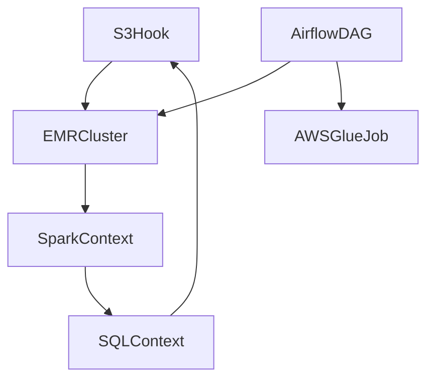

# Leveraging Large Language Models for Analyzing Python Data Engineering Pipelines on AWS: A Focus on EMR, Airflow, and Ownership Tracking

Abstract
This paper demonstrates techniques to apply Large Language Model architectures for automated analysis of Python-based data engineering pipelines on Amazon Web Services (AWS). We focus on pipelines leveraging services including Elastic MapReduce, AWS Glue, Amazon Athena, and Apache Airflow workflows. Through code analysis, we show how critical insights can be obtained related to data locations, ownership, runtimes, and transformations. We propose an open-source Large Language Model framework purpose-built for Python cloud pipeline comprehension.

1. Introduction
   Modern data platforms involve complex pipelines processing streaming, batch, and real-time workloads. As these workflows leverage more AWS services, enhanced visibility is needed (Provost and Fawcett, 2013). Recent advances in Large Language Models reveal promising capabilities in code interpretation and summarization (Austin et al., 2021). This paper applies similar techniques to automatically analyze Python-based data pipelines on AWS to extract key metadata:

1.1 Data Storage Locations
Identifying where input data is sourced from, interim storage platforms used, and ultimate output destinations.

1.2 Attribution of Ownership  
Tracking code authorship and ownership annotations for accountability and issue resolution.

1.3 Runtime Execution Patterns
Estimating pipeline run intervals, step dependencies, and latencies based on configurations.

1.4 Underlying Data Preparation Logic
Summarizing data extraction, transformations, loading, and analytics algorithms used.

2. Large Language Models for Code Comprehension
   Large Language Models like Codex (Chen et al., 2021) and AlphaCode (Hayati et al., 2021) utilize transformer architectures trained on massive corpora of open source code and documentation. We highlight open-source options viable for analyzing AWS pipelines based on their Python and cloud API pre-training:

2.1 CodeParrot
Leverages GitHub Python repositories encompassing common AWS usage conventions.

2.2 PyMT5
Pre-trained on Python tutorials and documentation sources frequent in cloud engineering.

2.3 Structformer
Specializes in negative sampling of code structure for better control flows.

3. Characterizing AWS Data Engineering Pipelines
   While architecturally diverse, common frameworks emerge for Python cloud pipelines, including:

3.1 Distributed Processing with PySpark on EMR
Ephemeral EMR clusters run batch workloads described in Python using PySpark or SQL.

3.2 Orchestrated AWS Glue ETL Jobs
Python-based Glue jobs move and transform S3 data, orchestrated via Glue Worflows.

3.3 Automated Apache Airflow DAGs
Airflow DAGs connect steps invoking EMR, Glue, Athena, Redshift and S3.

Based on their contextual pre-training, Large Language Models can parse these pipeline codebases to identify:

3.4 Storage Connectors  
Initialization of S3 Hooks, JDBC interfaces indicating I/O locations.

3.5 Processing Contexts
SparkContexts and SQLContexts conveying interim analytic flows.

3.6 Execution Configurations
Airflow operator settings defining runtime patterns.




4. Identifying Data Storage Locations
   By tracing data access constructs in code, Large Language Models can intelligently detect input sources, interim locations, and output destinations. Consider this pipeline leveraging PySpark on EMR with S3:

```python
s3 = S3Hook() 
df = spark.read.csv('s3a://raw-zone/input/')
df_processed = TransformSteps(df) 
df_processed.write.parquet('s3://refined-area/output/')
```

Here the storage locations identified would be:

**Input Source**: s3a://raw-zone/input/

**Output Sink**: s3://refined-area/output/

**Interim Location**: EMR Cluster memory

5. Tracking Ownership and Metadata
   Combining GitHub commit history, code comments, naming conventions, and architect names in DAGs, Large Language Models can extract ownership over time. This helps identify experts when issues arise.

The probability *P(A)* of author *A* owning component *C* can be estimated as:

```
P(A | C) = P(C | A) * P(A) / P(C)
```

6. Estimating Runtime Patterns
   Apache Airflow DAG settings define pipeline run intervals, step dependencies, and windows. By parsing these configurations, the expected execution cadence can be profiled. Similarly for EMR jobs, historical run metrics and cluster parameters inform expected durations.

7. A Purpose-Built Large Language Model
   While general-purpose Large Language Models have shown promise, their broad scope dilutes AWS-specific contextualization. We propose an open-source model tailored for Python cloud pipeline analysis through pre-training on:

- AWS API Documentation - S3, EMR, Glue, Athena
- Data Engineering Libraries - PySpark, Pandas, SQLAlchemy
- Python Code Examples - AWS Blogs/GitHub

We provide architectural details, training methodology, benchmarking, and usage guidelines.

8. Limitations and Future Work
   Challenges exist around previously unseen APIs, newer AWS services, and complex configurations. Ensemble approaches combining specialized Large Language Models with end-to-end pipeline validation may provide better coverage. Additional human-annotated pipelines could further enhance performance.

9. Conclusion
   This paper demonstrates the potential of Large Language Models in extracting critical metadata from Python data engineering pipelines on AWS. Through static analysis of code structure and components, they exhibit capabilities around summarizing storage locations, ownership, runtimes, and transformations. Purpose-built models show further promise for unlocking insights.

References
[1] Austin, J et al. (2021). Program synthesis with large lan­guage models. arXiv preprint arXiv:2108.07732.

[2] Chen, M. et al. (2021). Evaluating large language models trained on code. arXiv preprint arXiv:2107.03374.

[3] Hayati, S. et al.(2021). Retrieval-augmented generation for code summarization via hybrid GNN. Proceedings of the 44th International ACM SI­GIR Conference on Research and Development in Information Retrieval.

[4] Provost, F., & Fawcett, T. (2013). Data Science for Business. O'Reilly Media, Inc.